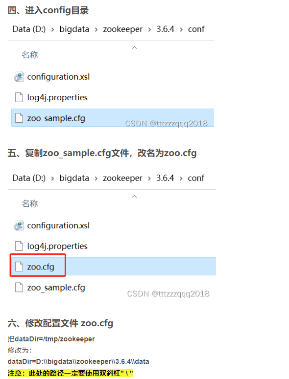
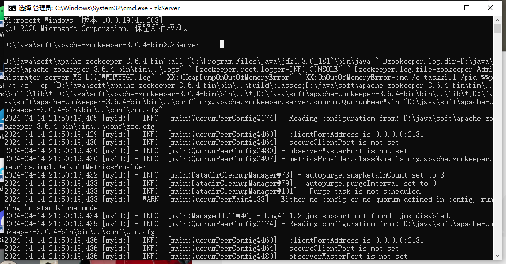
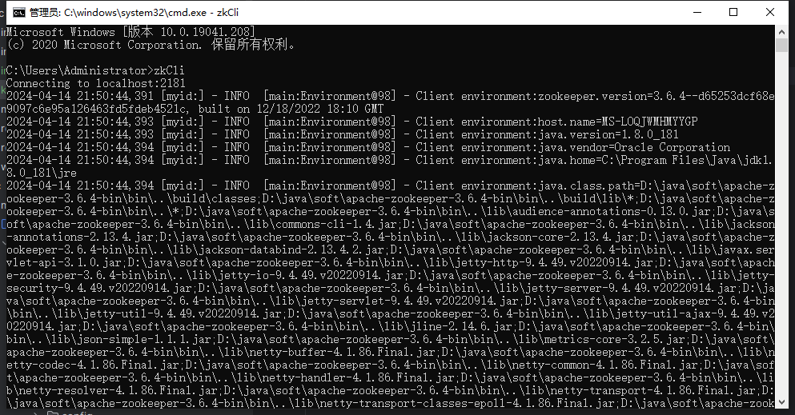
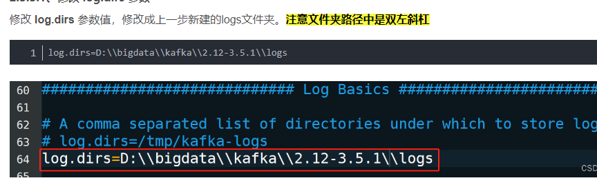
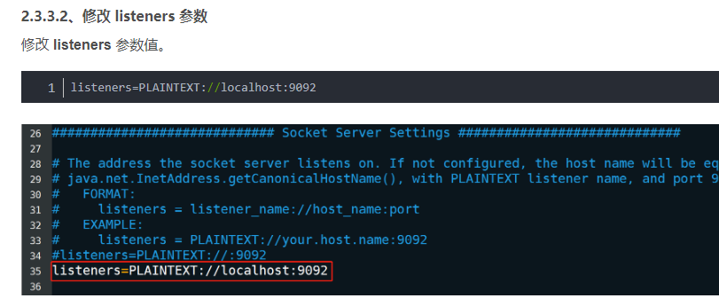
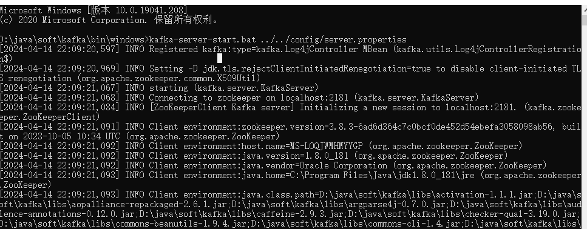

1、需要安装zookeeper  和 scala   （window  都需要设置环境变量）
   

    cmd启动zookeeper命令:   zkServer  

    cmd客户端连接Zookeeper命令: zkCli

2、安装kafka
    2.1、新建logs   ctrl+shift+N => 新建logs文件夹  
    2.2、修改 config\server.properties文件中的 

 

    2.3、启动kafka前要先启动zookeeper   zkServer    
    2.4、启动kafka :kafka-server-start.bat .\config\server.properties      

注意：如提示 输入内容太长 命令语法错误 的提示，是因为路径过长导致  比如  kafka——2.13-3.7.0  改为 kafka 即可 