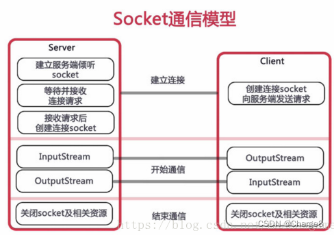

    WebSocket协议是基于TCP的一种新的网络协议。它实现了浏览器与服务器全双工(full-duplex)通信——允许服务器主动发送信息给客户端。
    WebSocket的最大特点就是，服务器可以主动向客户端推送信息，客户端也可以主动向服务器发送信息，是真正的双向平等对话。

    （1）建立在 TCP 协议之上，服务器端的实现比较容易。
    （2）与 HTTP 协议有着良好的兼容性。默认端口也是80和443，并且握手阶段采用 HTTP 协议，因此握手时不容易屏蔽，能通过各种 HTTP 代理服务器。
    （3）数据格式比较轻量，性能开销小，通信高效。
    （4）可以发送文本，也可以发送二进制数据。
    （5）没有同源限制，客户端可以与任意服务器通信。
    （6）协议标识符是ws（如果加密，则为wss），服务器网址就是 URL。

参考文章：
https://blog.csdn.net/qq_42402854/article/details/130948270

